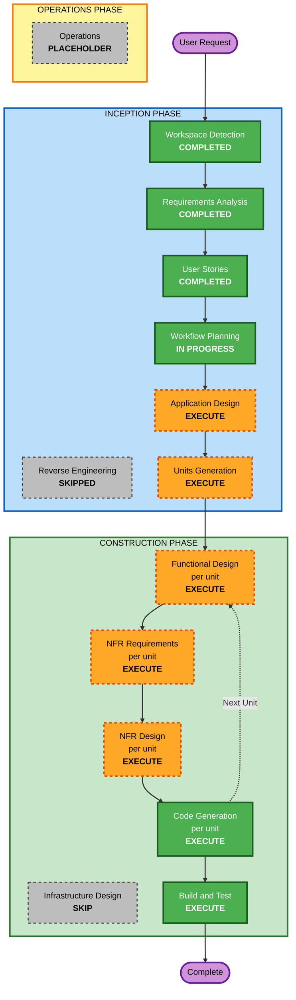

# Execution Plan(実行計画)— MasterMeister3

**作成日**: 2026-07-18
**入力**: requirements.md(FR-01〜13 / NFR-01〜08 / D-01〜21)、stories.md(48 ストーリー / Phase 1〜4)、personas.md

## Detailed Analysis Summary

### Change Impact Assessment
- **User-facing changes**: Yes — 全機能が新規のユーザ向け機能(SPA 全画面 + デザインシステム)
- **Structural changes**: Yes — グリーンフィールドのため全アーキテクチャを新規構築(backend / frontend / devenv、ルート Gradle 統合)
- **Data model changes**: Yes — 内部 DB(ユーザ、接続、取込スキーマ、権限、保存クエリ、履歴、監査ログ等)の新規設計
- **API changes**: Yes — REST API 一式を新規定義(認証、管理、メンテナンス統一 API、クエリ系)
- **NFR impact**: Yes — Security Baseline 全面適用、PBT Partial、i18n、2 テーマ、12-Factor WAR

### Risk Assessment
- **Risk Level**: Medium — グリーンフィールドのためロールバック懸念はないが、権限モデル(D-21)と複数 RDBMS 方言対応に設計リスクがある
- **Rollback Complexity**: Easy(新規開発、既存システムへの影響なし)
- **Testing Complexity**: Complex(権限合成の PBT、4 RDBMS 対応、認証フロー)

## Workflow Visualization



### Text Alternative(テキスト版)
```
INCEPTION PHASE
- Workspace Detection ........ COMPLETED
- Reverse Engineering ........ SKIPPED(グリーンフィールド)
- Requirements Analysis ...... COMPLETED
- User Stories ............... COMPLETED
- Workflow Planning .......... IN PROGRESS(本書)
- Application Design ......... EXECUTE
- Units Generation ........... EXECUTE

CONSTRUCTION PHASE(ユニットごとに繰り返し)
- Functional Design .......... EXECUTE(per unit)
- NFR Requirements ........... EXECUTE(per unit)
- NFR Design ................. EXECUTE(per unit)
- Infrastructure Design ...... SKIP
- Code Generation ............ EXECUTE(per unit)
- Build and Test ............. EXECUTE(全ユニット完了後)

OPERATIONS PHASE
- Operations ................. PLACEHOLDER
```

## Phases to Execute

### 🔵 INCEPTION PHASE
- [x] Workspace Detection (COMPLETED)
- [x] Reverse Engineering (SKIPPED — グリーンフィールド)
- [x] Requirements Analysis (COMPLETED)
- [x] User Stories (COMPLETED)
- [x] Workflow Planning (本書)
- [ ] Application Design - **EXECUTE**
  - **Rationale**: 全コンポーネントが新規。権限解決サービス(D-21)、監査ログ基盤(D-20 別トランザクション)、認証、DB 方言抽象化などサービス層の設計が必須
- [ ] Units Generation - **EXECUTE**
  - **Rationale**: backend / frontend / devenv + Phase 1〜4 の段階リリースを持つ複合システムであり、ユニット分割と依存順序の定義が必要(デザインシステム+モック確認ゲート(D-08)を独立ユニットとして扱う想定)

### 🟢 CONSTRUCTION PHASE(ユニットごと)
- [ ] Functional Design - **EXECUTE**(該当ユニット)
  - **Rationale**: 権限解決アルゴリズム、トークンローテーション、オールオアナッシング反映など複雑な業務ロジックと新規データモデルを持つ。PBT-01(Testable Properties)の文書化もここで実施
- [ ] NFR Requirements - **EXECUTE**(初回ユニットで集中実施、以降は差分)
  - **Rationale**: PBT フレームワーク選定(PBT-09: jqwik / fast-check 想定)、Security Baseline の実装方式決定、性能・設定項目の確定が必要
- [ ] NFR Design - **EXECUTE**(該当ユニット)
  - **Rationale**: CSP・セキュリティヘッダー、監査ログ別トランザクション、キャッシュ無効化、ロックアウト等の NFR パターンの組み込み設計
- [ ] Infrastructure Design - **SKIP**
  - **Rationale**: クラウドインフラなし。デプロイ形態は要件で確定済み(自己完結型 WAR、NFR-02)。開発環境(devenv の Docker Compose)は該当ユニットの Code Generation で扱う。※ 必要になれば後から追加可能
- [ ] Code Generation - **EXECUTE**(ALWAYS、ユニットごとに Planning + Generation)
- [ ] Build and Test - **EXECUTE**(ALWAYS、全ユニット完了後)

### 🟡 OPERATIONS PHASE
- [ ] Operations - PLACEHOLDER

## ユニット分割の見通し(Units Generation で確定)

| 順序 | ユニット候補 | 対応フェーズ |
|---|---|---|
| 1 | プロジェクト骨格 + 開発環境(ルート Gradle 統合、backend/frontend 雛形、devenv) | 基盤 |
| 2 | デザインシステム + モック(トークン、コンポーネント、主要画面。**モック確認ゲートあり — D-08**) | 基盤 |
| 3 | 認証・ユーザ管理 + 監査ログ記録基盤(D-20) | Phase 1 |
| 4 | 接続管理・スキーマ取込・アクセス制御・グループ・YAML | Phase 2 |
| 5 | マスタメンテナンス | Phase 3 |
| 6 | クエリ系(ビルダー・保存・実行・履歴)+ 監査ログ閲覧 | Phase 4 |

## Estimated Timeline
- **Total Stages**: INCEPTION 残り 2(Application Design、Units Generation)+ ユニット × 構築ステージ + Build and Test
- **Estimated Duration**: ユニット 6 個想定。1 ユニットあたり設計〜コード生成で 2〜5 セッション程度(単独開発・承認ゲート込み)

## Success Criteria
- **Primary Goal**: MVP(Phase 1〜3)の動作するアプリケーション + Phase 4 のクエリ系機能
- **Key Deliverables**: 実行可能 WAR(`./gradlew build` 一発)、デザインシステム(モック承認済み)、テスト一式(例示 + PBT Partial)、devenv
- **Quality Gates**: 各ステージのユーザ承認、Security Baseline / PBT Partial のコンプライアンス(例外 3 件は文書化済み: D-12 / D-16 / D-19)、モック確認ゲート(D-08)
